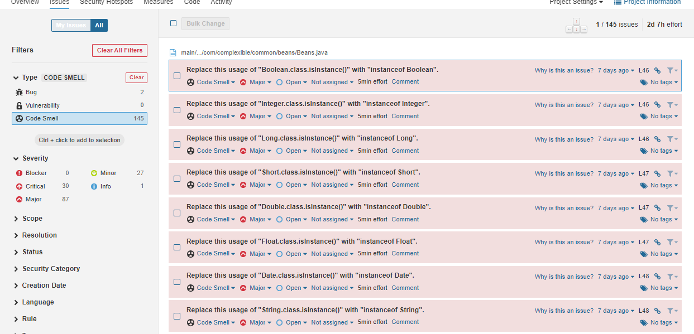

# Introduction

We decided to perform Static Analysis on the project using SonarQube.  This issue will detail the steps that have to be done in order to finish this task. Sonar does static code analysis, which provides a detailed report of bugs, code smells, vulnerabilities, code duplications.


# Installing SonarQube Setup

0. Download and install [Java 11](https://www.oracle.com/java/technologies/javase/jdk11-archive-downloads.html). 
    add jdk 11 to Path in envioronment varialbles.

1. Download [SonarQube](https://www.sonarqube.org/downloads/) zip file. Add appropriate bin folder to PATH, according to system.

2. run cmd as administrator, navigate to sonarqube and type StartSonar to run sonarqube. SonarQube local instance is at `localhost:9000`. Default credentials are as following: user: admin, pass: admin


# SonarScanner setup

1. Download the [sonarscanner](https://docs.sonarqube.org/latest/analysis/scan/sonarscanner/) and add the bin to `PATH`.
2. 
3. [Create a configuration file](https://docs.sonarqube.org/latest/analysis/scan/sonarscanner/) in your project's root directory called `sonar-project.properties`:

``` java

# must be unique in a given instance
sonar.projectKey=my:project

sonar.java.binaries=target


```

# Running an Analysis

Following command is used to run on the analysis, where authentication token can be generated on sonarqube,
under user -> my account -> security -> generate

```
sonar-scanner -D sonar.login=myAuthenticationToken
```

if the run was successfull user should see "execution successful" message, 
and by pressing the link can see the analysis.

# Analysis output

overall code overview:


Some code smells:


