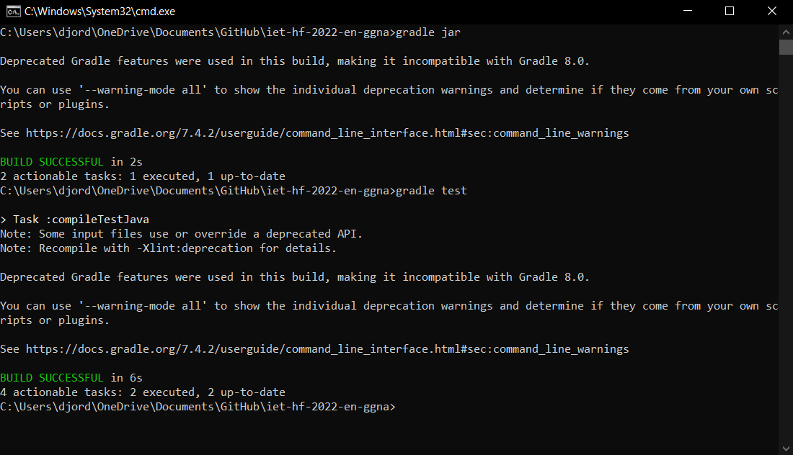
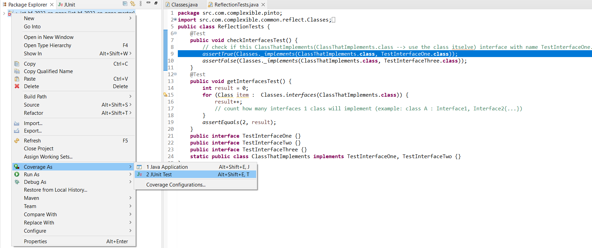
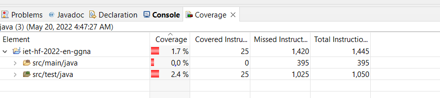
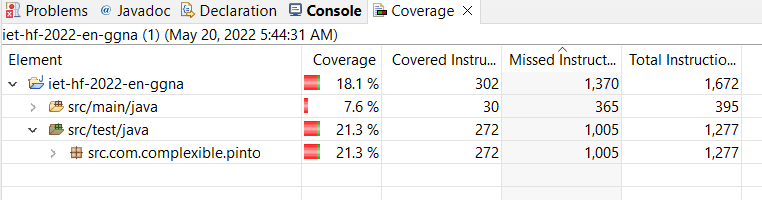

# Test Cases Documentation

### POJECT

- Product Name: Pinto

### PROJECT DESCRIPTION

Pinto is a Java framework for transforming Java beans into RDF (and back). It aims to be simple and easy to use. No annotations or configuration are required. If you have a compliant Java bean Pinto will turn it into RDF.

The rdf4j framework is used to represent RDF primitives such as Graph and Statement.

### PROGRAMMERS

- Nikola Dordevic
- Alghaith Ahmad
- Alireza Jamshidi
- Giorgi Bestavashvili


## BUILD

To create the artifacts:

```bash
$ gradle jar
```

And to run the tests:

```bash
$ gradle test
```
The application and all the tests successfully run.



## JUNIT TESTS

We first started with refactoring the code to reduce the code smells and define a function for all the redundant code and code duplication. Then implemented the test cases.


## BeansTests

| \#  | TESTCASE | Description |
| --- | --------- |--------- | 
| 1   | TestGetDeclaredFields() | Creates generic iterable list of type Field, ArrayList of type string that would be filled with results from iterable Field items based on if statement filtering for all items that does not contain "transient" inside themselves then add it to "actual" ArrayList. Afterwards, ArrayList of type string used to compare with what we actually get after filtering. test assumption itself, comparing actual with expected results          |   


## ConditionCreator

| \#  | Class | Description |
| --- | --------- |--------- | 
| 1   | ConditionCreator | private fields used for creating ConditionCreator instance. ConditionCreator constructor takes 2 parameters, Then it throws exception if class is not a static class, standalone class, afterwards it checks if condition type is not memeber of class or Modifier is static, it gives access to ConditionType constructor throughout conditionType instance and method getDeclaredConstructor(). create new instance just based on target (meaning T --> generic class that would be defined later)          |


## RDFMapperBuilderTestsIET

| \#  | TESTCASE | Description |
| --- | --------- |--------- | 
| 1   | createBuilderWithCustomValueFactory() | Creation of aObj using SimpleValueFactory(used for creating singlton instances), result of building will be stored in aObj --> writeValue(aObj); Then testing if aObj is same as aReturned          |
| 2   | createBuilderWithNamespaces() | Creating class with enum, afterwards add some fields and data that is which will be used inside of that instance(type: classWithEnum) for testing. We are adding data to ArrayList customNameSpace. MapperTests will create expected data, afterwards we give some data that the program will use, in final step we compare them with assertEqueal. Returned and expected data are compared to see if they are the same.          |
| 3   | createBuilderWithMapFactory() | Creating aObj class with enum, afterwards add some fields and data that is which will be used inside of that instance(type: classWithEnum) for testing. We are using RDFMapper.Builder builder = RDFMapper.builder().mapFactory( new RDFMapper.DefaultMapFactory());. MapperTests will create expected data, afterwards we give some data that the program will use, in final step we compare them with assertEqueal. Returned and expected data are compared to see if they are the same.           |

 
 


 ## RDFMappingExceptionTests

| \#  | TESTCASE | Description |
| --- | --------- |--------- | 
| 1   | testExceptionIsPassedOn_UsingThrowable() | Testing if the exception will be thrown.          |
| 2   | testExceptionIsPassedOn_UsingThrowableAndMessage() | Testing if exception will be thrown with given message.          |
| 3   | testRDFMapper_newInstance_noConstructor | Testing of creation of new instance with no constructor.           |
 
 

 ## ReflectionTests

| \#  | TESTCASE | Description |
| --- | --------- |--------- | 
| 1   | checkInterfacesTest()() | Check if this ClassThatImplements(ClassThatImplements.class --> use the class itselve) interface with name TestInterfaceOne. class is used since the interface will also inherit form class.          |
| 2   | getInterfacesTest() | count how many interfaces 1 class will implement (example: class A : Interface1, Interface2{...}).         |


# CODE COVERAGE
## Introduction
For all test cases, it is important that coverage always analyses the whole code. This is a definitive and statistical proof that all testable code is indeed tested.
## Tools
We used the following tools:

- Eclipse

- EclEmma plugin for eclipse – code coverage tool
## Steps
First, we need to install EclEmma on Eclipse. As soon as you manage to install the plugin, an additional option on the project execution context menu will be available for code coverage.



Basically, the tool runs the jUnit test and documents all source code (both junit and project source) and display the coverage level of each implementation method / class. This is extremely helpful in measuring the code quality and stability of our code.




The results of the code coverage was not satisfying. We went through the test cases and checked line by line to find the mistakes that we have made to work on the tests in order to increase the percentage of our code coverage.
After solving errors, we were able to increase the code coverage from 1.7% to 18.1%.

